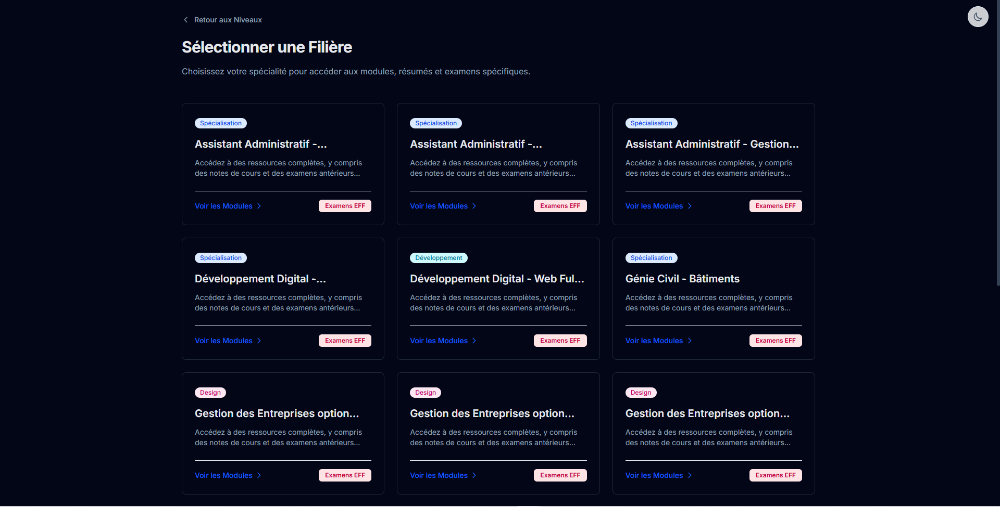

#  OFPPT Cours - Open Source Learning Platform



A modern, high-performance educational platform designed for **OFPPT** trainees. Built with **React 19**, **Tailwind CSS v4**, and **Vite (Rolldown)**, featuring a clean "Slate" design system, intelligent dark mode, and full French localization.

##  Key Features

###  Comprehensive Curriculum
-   **Structure**: Browse by Year → Formation (TS/T/Q) → Modules → Courses.
-   **Resources**: Access PDF summaries, courses, and practical exercises (TP).
-   **Exams**: Dedicated section for **EFF** (Examen de Fin de Formation) with corrections.

###  Clean Slate Design System
-   **Academic UI**: A distraction-free interface using a refined Slate color palette (`#f8fafc`).
-   **Smart Dark Mode**: Fully optimized dark theme (`#020617`) with intelligent logo adaptation and contrast handling.
-   **Responsive**: Mobile-first design that works perfectly on phones, tablets, and desktops.

###  Technical Excellence
-   **Performance**: Near-instant page loads with **Rolldown** bundler and code splitting.
-   **SEO**: Fully optimized with JSON-LD structured data and meta tags for visibility.
-   **PWA-Ready**: Built with modern web standards for a native-like experience.
-   **Error Tracking**: Integrated with **Sentry** for real-time error monitoring.

###  About Project
-   **Technical Showcase**: A dedicated `/about-project` page detailing the architecture and design choices.

##  Cutting-Edge Tech Stack

-   **Frontend**: React 19, React Router v7
-   **Styling**: Tailwind CSS v4, PostCSS
-   **Build Tool**: Vite (powered by Rolldown)
-   **State Management**: TanStack Query v5
-   **Analytics**: Google Analytics 4 (SPA Integration)
-   **Monitoring**: Sentry
-   **Icons**: Heroicons / Custom SVG System

##  Installation

1.  **Clone the repository:**
    ```bash
    git clone https://github.com/zaidbouallala/ofppt-cours.git
    cd ofppt-cours
    ```

2.  **Install dependencies:**
    ```bash
    npm install
    # or
    yarn install
    ```

3.  **Setup Environment Variables:**
    Create a `.env` file in the root directory:
    ```env
    VITE_GA_MEASUREMENT_ID=G-XXXXXXXXXX
    ```

4.  **Start the development server:**
    ```bash
    npm run dev
    ```

##  Contributing

We welcome contributions! Please see our [Contributing Guide](CONTRIBUTING.md) for details.

1.  Fork the project
2.  Create your Feature Branch (`git checkout -b feature/AmazingFeature`)
3.  Commit your Changes (`git commit -m 'Add some AmazingFeature'`)
4.  Push to the Branch (`git push origin feature/AmazingFeature`)
5.  Open a Pull Request

---

*Unofficial educational resource for the OFPPT community.*
